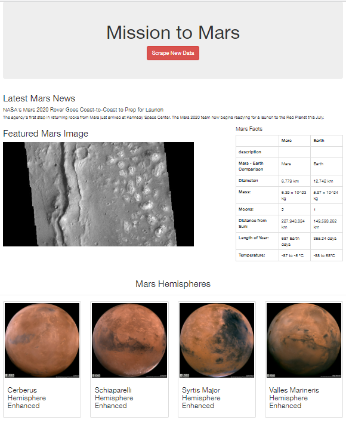

# Mission to Mars

## Overview
This project is based on BeautifulSoup and Splinter to scrape full-resolution images of Mars’s hemispheres and the titles of those images, store the scraped data on a Mongo database, use a web application to display the data, and alter the design of the web app to accommodate these images.

## Resources
  - Data Tools: Pandas, BeautifulSoup, Splinter, ChromeDriverManager and PyMongo
  - Web Server: Flask
  - DBMS: MongoDB 5.0.4
  - Standars: HTML5 and Bootstrap 3
  - Web pages scraped: 
    - https://redplanetscience.com 
    - https://spaceimages-mars.com 
    - https://galaxyfacts-mars.com 
    - https://marshemispheres.com/

## Results

Mission to Mars Web application mobile-responsive:

